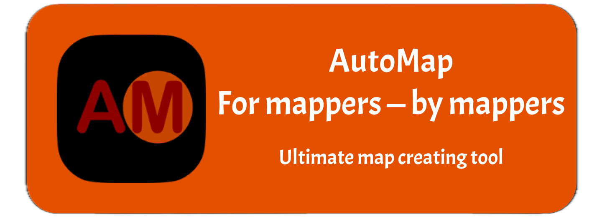

# AutoMap

---


`AutoMap` — is an ultimate map creating tool. With `AM` you can create maps by simple mouse pressing.

## Features

---


`AutoMap` has different options. There is Default Map, Flag map and World map. Here is map example *(Default map)*


## Stack

---
There are libraries we are currently using:

- AI
    - [google-genai](https://github.com/googleapis/python-genai)
- Drawing
    - [pillow](https://github.com/python-pillow/Pillow)
- GUI
    - tkinter
    - [customtkinter](https://github.com/TomSchimansky/CustomTkinter)
- Other
    - [dotenv](https://github.com/theskumar/python-dotenv)

## Installation

---

To get started with **AutoMap**, follow these steps:

1. **Clone the repository:**
   ```bash
   git clone https://github.com/avsbestua/auto_map.git
   cd automap
2. **Set up a virtual environment**
    ```bash
    python -m venv venv
    venv\Scripts\activate # On macOS and Linux: source venv/bin/activate
3. **Installing dependencies**
    ```bash
    pip install -r requirements.txt # On macOS and Linux can be pip3 install -r requirements.txt
4. **Environment Set up**
   The project uses a `.env` file for API keys.
    - Copy the template file:
    - You can get `GEMINI_API_KEY` [here](https://aistudio.google.com/api-keys)
    - Open `.env` and replace the placeholder values with your actual API keys.

## License

---

This project is licensed under the **Apache License 2.0**.

Copyright © 2025-2026 **Avsbest**.

Licensed under the Apache License, Version 2.0 (the "License");
you may not use this file except in compliance with the License.
You may obtain a copy of the License at

    http://www.apache.org/licenses/LICENSE-2.0

Unless required by applicable law or agreed to in writing, software
distributed under the License is distributed on an "AS IS" BASIS,
WITHOUT WARRANTIES OR CONDITIONS OF ANY KIND, either express or implied.
See the License for the specific language governing permissions and
limitations under the License.